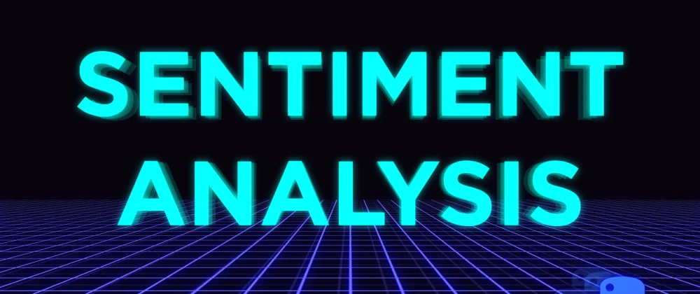
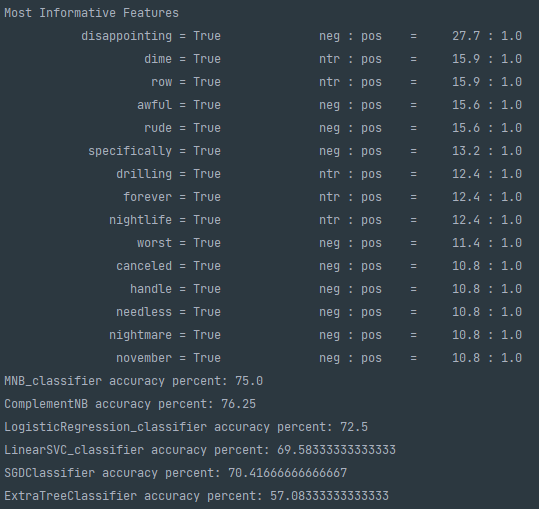
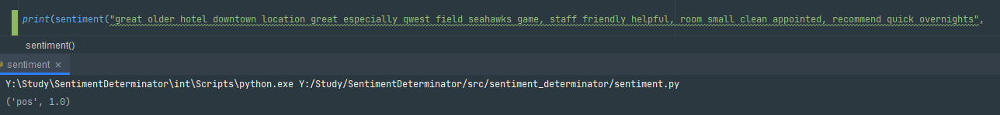

# Raspoznovalka Inc. - sentiment determinator

## Налаштування проекту
Для початку потрібно:
1.  Встановити середовище виконання [Python](https://www.python.org/ftp/python/3.9.4/python-3.9.4-amd64.exe)

2. Клонувати проект за допомогою команди `git clone https://github.com/KepAlex-404/Raspoznovalka.git`

3. Встановити всі потрібні модулі командою `pip install -r requirements.txt`

>Пояснювальна записка до проекту знаходиться [тут](docs/introduction.md)

## Usage

### Simple Training
Для початку потрібно:
* Підготувати датасет (зібрати самому, або скачати готовий з сайту [kaggle](https://www.kaggle.com/datasets))
    * скомпонувати датасет у форматі текст | оцінка,
    * оцінка у форматі: 
      * 1-негатив, 
      * 2-позитив, 
      * 3-нейтрал

*  Натренерувати мережу на цей датасет
    * завантажити готовий датасет у директорію resources
    * у модулі trainer_on_full вказати к-ть оброблювальної інформації
    * запустити trainer_on_full та дочекатися завершення
    * у директорії algos з'явиться навчені моделі
    
### Analise
* Подати в модуль sentiment текст для аналізу
* Отримаємо відповідь у форматі настрій | точність
## Example

## Контактна інформація
* Телеграм - https://t.me/Kep_Alex
* Робочий e-mail - gryshyn.alex@gmail.com

## Інше
[Методичні вказівки](https://jace-dev.herokuapp.com/design/js-talks#/)

[Звітність](https://drive.google.com/file/d/1A5Pxqb0Esy78t9xhMlkWzzx4chdkXAl2/view?usp=sharing)