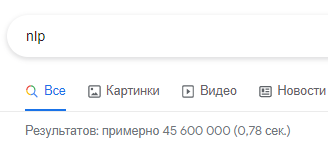

# Автоматичне визначення тональності тексту (Sentiment Analysis)

## Вступ

Суть цього проекту полягає в використанні різних методів машинного 
навчання для вирішення проблем, пов'язаних з обробкою природної мови (NLP)

Однією з таких проблем є автоматичне визначення емоційного забарвлення 
(позитивний, негативний, нейтральний) текстових даних, тобто аналізу тональності 
(sentiment analysis). Мета цього завдання полягає у визначенні, чи є даний текст 
(припустимо огляд фільму або коментарі) позитивним, негативним або нейтральним 
за своїм впливом на репутацію конкретного об'єкта. Труднощі аналізу тональності 
полягають в присутності емоційно збагаченої мови - сленг, багатозначність, 
невизначеність, сарказм, всі ці чинники вводять в оману не тільки людей, а й комп'ютери.

Взагалі, ця тема є однією з найбільш обговорюваних в усьому світі останнім часом, достатньо
глянути на результати видачі пошукової системи за запитом NLP

## Суть проблеми
Отже, в чому ж полягає проблема і як її вирішити?

Припустимо ми маємо текстове повідомлення (опис фільму, рецензія, коментар):

    "This film made me upset. It's just taking your free time and throwing it in a trash ((( "

Або ж:

    "The best movie I've ever seen !!! Musical composition, actors, scenario, etc. all this stuff are just amazing !!!"

У першому прикладу система повинна видати негативний результат, так як коментар негативний, 
а в другому відповідно позитивний. Подібного роду завдання в машинному навчанні називається класифікацією, 
а метод - навчання з учителем. 

Тобто, спочатку алгоритм на навчальній вибірці «тренується», 
зберігаючи необхідні коефіцієнти та інші дані моделі, потім при вході нових даних з певною ймовірністю класифікує їх.

***Ремарка: для навчальної вибірки я використовував рецензії на готелі з сайту [tripadvisor](https://www.tripadvisor.ru/)***
***
## Вирішення завдання

+ ###Крок 1. Передобробка
    У цій стадій видаляються всі html теги, пунктуаций, символи.
    Дана операція здійснюється за допомогою регулярних виразів.

            def complex_formatter(text: Set[str]) -> str:
                text = sorted(text)
                temp = ' '.join(text) \
                    .replace(',', ' ').lower() \
                    .replace('"', "").replace("'", '') \
                    .replace('\n', ' ').replace('  ', ' ') \
                    .replace(' ', ' ').replace('ё', 'е').replace(';', '').strip()
                temp = temp.encode("utf-8", "ignore").decode()
                new = re.sub(r'^https?:\/\/.*[\r\n]*', '', temp, flags=re.MULTILINE)
                return new

    Також всі числа і посилання в тексті замінюються на теги
    Далі в тексті присутні так звані «стоп слова» - це часті слова в мові, які в основному не несуть ніякої смислове
    навантаження (наприклад, в англійській мові це такі слова як «the, at, about ...»). 
  
    Стоп слова видаляються за допомогою пакета Python Natural Language Toolkit (NLTK), крім того
    модифікуючи кожне слова в початкову форму
  
  
        for i, row in enumerate(stream):
        """розподіл по тональності контенту з датасету"""
        if row[1] == '1':
            documents.append((row[0], "neg"))
            words = nltk.word_tokenize(row[0], language='english')
            pos = tuple(nltk.pos_tag(words, lang='eng'))

            for w in pos:
                if w[1] in allowed_word_types:
                    all_words.append(w[0].lower())
                    n += 1

        elif row[1] == '2':
            documents.append((row[0], "pos"))
            words = nltk.word_tokenize(row[0], language='english')
            pos = tuple(nltk.pos_tag(words, lang='eng'))

            for w in pos:
                if w[1] in allowed_word_types:
                    all_words.append(w[0].lower())
                    p += 1

        elif row[1] == '3':
            documents.append((row[0], "ntr"))
            words = nltk.word_tokenize(row[0], language='english')
            pos = tuple(nltk.pos_tag(words, lang='eng'))

            for w in pos:
                if w[1] in allowed_word_types:
                    all_words.append(w[0].lower())
                    nt += 1

+ ###Крок 2. Подання у вигляді вектора

  

  Ми спробуємо замінити кожне слово в списку номером його семантичної групи. 
  У підсумку ми отримаємо щось на кшталт «мішка слів», але з більш глибоким змістом. 
  Для цього використовується технологія Word2Vec від Google. 
  Його можна знайти в пакеті бібліотеки gensim, з вбудованими моделями Word2Vec.
  

  

  

  Суть моделі Word2Vec полягає в наступному - на вхід дається великий обсяг тексту 
  (в нашому випадку приблизно 10000 відгуків), на виході ми отримуємо зважений вектор для кожного слова, 
  фіксований довжини (довжина вектора задається вручну), яка зустрічається в датасета.
  

        def preprocess_text(spam):
                """попереднє оброблення тексту"""
        
    
            lol = lambda lst, sz: [lst[i:i + sz] for i in range(0, len(lst), sz)]
            txtpart = lol(spam, 1000)
            res = []  # обработанный текст
        
            for txtp in txtpart:
                alltexts = ' '.join([txt + ' br ' for txt in txtp])
        
                words = mystem.lemmatize(alltexts)
                tokens = [token for token in words if token
                          not in eng_stopwords
                          and token != " "
                          and token.strip() not in punctuation
                          and token.strip() not in digits]
                doc = []
                for txt in tokens:
                    if txt != '\n' and txt.strip() != '':
                        if txt == 'br':
                            res.append(doc)
                            doc = []
                        else:
                            doc.append(txt)
            res = [' '.join(i) for i in res]
            """список обработанных отзывов"""
            return res
    
***Ремарка: на системах Windows є проблема повільної роботи бібліотеки pymystem3 
(новий виклик з неї займає в рази більше часу ніж на Unix подібних системах), через що було прийнято рішення об'єднати тексти
за допомогою вищевказаного коду***

+ ###Крок 3. Класифікація текстів
Отже, на даному етапі ми вже видалили всі непотрібні речі, перетворили текст 
у вектор, і тепер виходимо на фінішну пряму. Я використовував декілька алгоритмів класифікації, результат роботи яких 
потім об'єднував та використовував середнє значення

Алгоритми вже реалізовані в пакеті scikit-learn, все, що нам залишається це надати наші текстові дані.
Далі алгоритми все беруть на себе, тренуються на навчальній вибірці перевіряє результат навчання на тестовій та 
зберігає всі необхідні дані.

    """розбиття на тестовий та тренувальний набір"""
    training_set = featuresets[:int(len(featuresets) * 0.8)]
    testing_set = featuresets[int(len(featuresets) * 0.8):]

і як приклад - навчання на наївному алгоритмі

    """навчання на наївному поліноміальному алгоритмі"""
    MNB_classifier = SklearnClassifier(MultinomialNB())
    MNB_classifier.train(training_set)
    print("MNB_classifier accuracy percent:", (nltk.classify.accuracy(MNB_classifier, testing_set)) * 100)
    
    """збереження моделі"""
    save_classifier = open("algos/MNB_classifier5k.pickle", "wb")
    pickle.dump(MNB_classifier, save_classifier, protocol=pickle.HIGHEST_PROTOCOL)
    save_classifier.close()
    del MNB_classifier

+ ###Крок 4. Використання моделей
    
    В результаті навчання ми маємо такий набір моделей 
>Детальніше про кожну з них [тут](../src/models.md)

    voted_classifier = VoteClassifier(
        ExtraTreeClassifier,
        LinearSVC_classifier,
        MNB_classifier,
        ComplementNB_classifier,
        LogisticRegression_classifier,
        SGDC_classifier)

Ці моделі ми об'єднуємо в єдиний класифікатор який згодом і використовуємо на практиці

    class VoteClassifier(ClassifierI, ABC):
        """клас що об'єднує в собі результати роботи усіх наявних моделей"""
    
        def __init__(self, *classifiers):
            self._classifiers = classifiers
    
        def classify(self, features):
            """метод розрахунку результату"""
            votes = []
            for c in self._classifiers:
                v = c.classify(features)
                votes.append(v)
            return mode(votes)
    
        def confidence(self, features):
            """метод розрахунки точності результату"""
            votes = []
            for c in self._classifiers:
                v = c.classify(features)
                votes.append(v)
            choice_votes = votes.count(mode(votes))
            conf = choice_votes / len(votes)
            return conf

+ ### Тести

>Всі тести знаходяться [тут](../tests/test_result.md)
