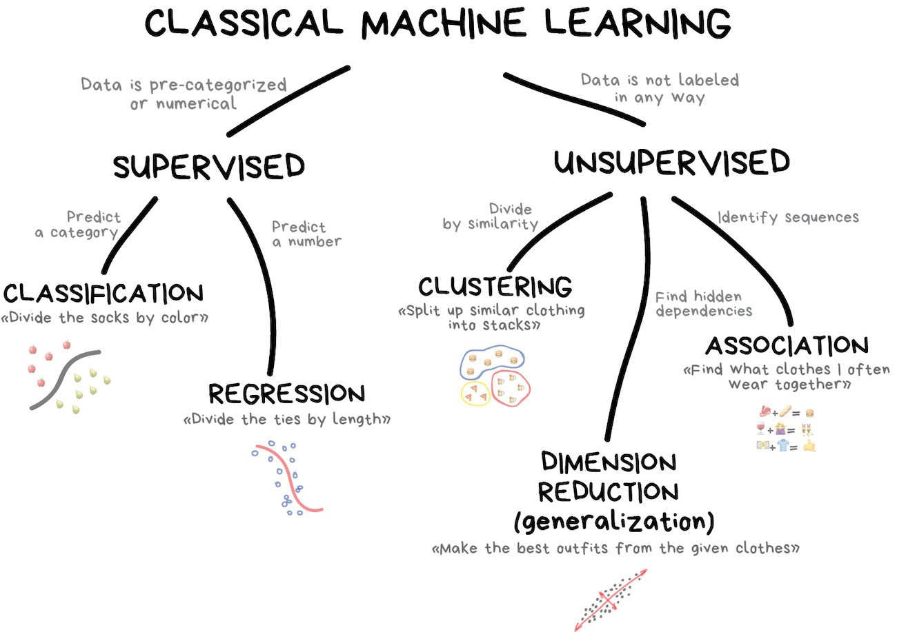

# Опис використаних моделей

## MultinomialNB
>Детальніше [тут](https://scikit-learn.org/stable/modules/generated/sklearn.naive_bayes.MultinomialNB.html)
Наївний класифікатор Байєса для мультиноміальних моделей

Багатозначний класифікатор Наїва Байєса підходить для класифікації з дискретними ознаками 
наприклад, кількість слів для класифікації тексту). Багаточленний розподіл, як правило, вимагає цілочисельного 
підрахунку ознак. 

Однак на практиці дробовий підрахунок також може спрацювати.

    import numpy as np
    rng = np.random.RandomState(1)
    X = rng.randint(5, size=(6, 100))
    y = np.array([1, 2, 3, 4, 5, 6])
    from sklearn.naive_bayes import MultinomialNB
    clf = MultinomialNB()
    clf.fit(X, y)
    MultinomialNB()
    print(clf.predict(X[2:3]))
    >>> 3

## ComplementNB
>Детальніше [тут](https://scikit-learn.org/stable/modules/generated/sklearn.naive_bayes.ComplementNB.html)

Класифікатор Наївного Байєса "Доповнення" був розроблений для виправлення 
"суворих припущень", зроблених стандартним багаточленовим класифікатором Наїв Байєса. 
Це особливо підходить для незбалансованих наборів даних.

    import numpy as np
    rng = np.random.RandomState(1)
    X = rng.randint(5, size=(6, 100))
    y = np.array([1, 2, 3, 4, 5, 6])
    from sklearn.naive_bayes import ComplementNB
    clf = ComplementNB()
    clf.fit(X, y)
    ComplementNB()
    print(clf.predict(X[2:3]))
    >>> 3

## LogisticRegression
>Детальніше [тут](https://scikit-learn.org/stable/modules/generated/sklearn.linear_model.LogisticRegression.html)

Логістична регресія, попри свою назву, є лінійною моделлю класифікації, а не регресією. 
Логістична регресія також відома в літературі як класифікація максимальної ентропії (MaxEnt) або 
лінійно-лінійний класифікатор. У цій моделі імовірності, що описують можливі результати одного випробування, 
моделюються за допомогою логістичної функції.

    >>> from sklearn.datasets import load_iris
    >>> from sklearn.linear_model import LogisticRegression
    >>> X, y = load_iris(return_X_y=True)
    >>> clf = LogisticRegression(random_state=0).fit(X, y)
    >>> clf.predict(X[:2, :])
    array([0, 0])
    >>> clf.predict_proba(X[:2, :])
    array([[9.8...e-01, 1.8...e-02, 1.4...e-08],
           [9.7...e-01, 2.8...e-02, ...e-08]])
    >>> clf.score(X, y)
    0.97...

## LinearSVC
>Детальніше [тут](https://scikit-learn.org/stable/modules/generated/sklearn.svm.LinearSVC.html)

SVC, NuSVCі LinearSVC є класами, здатними виконувати двійкову та багатокласову класифікацію набору даних.
SVCі NuSVC є подібними методами, але приймають дещо різні набори параметрів і мають різні математичні формулювання

З іншого боку, LinearSVCє ще одна (швидша) реалізація класифікації векторів підтримки для випадку лінійного ядра.

## SGDClassifier
>Детальніше [тут](https://scikit-learn.org/stable/modules/generated/sklearn.linear_model.SGDClassifier.html)

Стохастичний градієнтний спуск (SGD) - це простий, але дуже ефективний підхід до встановлення лінійних класифікаторів 
та регресорів під опуклі функції втрат, такі як (лінійні) опорні векторні машини та логістична регресія. 

Незважаючи на те, що SGD існує у спільноті машинного навчання вже давно, зовсім недавно йому приділяється значна
увага в контексті масштабного навчання.

## ExtraTreeClassifier
>Детальніше [тут](https://scikit-learn.org/stable/modules/generated/sklearn.tree.ExtraTreeClassifier.html)

Дерева рішень (DT) - це непараметричний контрольований метод навчання, що використовується для класифікації та регресії. 
Мета полягає в тому, щоб створити модель, яка передбачає значення цільової змінної шляхом вивчення простих правил 
прийняття рішень, виведених із особливостей даних. Дерево можна розглядати як кусочно постійне наближення.

Наприклад, у наведеному нижче прикладі дерева рішень вчаться на основі даних для апроксимації синусоїдичної кривої 
за допомогою набору правил прийняття рішень if-then-else. Чим глибше дерево, тим складніші правила прийняття рішень 
і монтер моделі.

