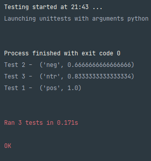

# Результати тестів емоційного забарвлення тексту

+ Текст тесту 1
  
        nice hotel expensive parking got good deal stay hotel anniversary, arrived late evening took advice previous reviews 
        did valet parking, check quick easy, little disappointed non-existent view room room clean nice size, bed comfortable 
        woke stiff neck high pillows, not soundproof like heard music room night morning loud bangs doors opening closing hear 
        people talking hallway, maybe just noisy neighbors, 
        aveda bath products nice, did not goldfish stay nice touch taken advantage staying longer, location great walking 
        distance shopping, overall nice experience having pay 40 parking night

+ Текст тесту 2
  
        warwick bad good reviews warwick shocks staff quite rude rooms fairly dirty, cut asked 
        bandaid did not, requested bottle opener did not better service 

+ Текст тесту 3
    
        average facilities need overhaul feel dated, service ok. reason stay good rate need central location    

 ## Результати тестів:

 ## Код UNIT-тесту:
  
      class MyTestCase(unittest.TestCase):
  
      def test_neutral(self):
          self.assertEqual('ntr', test_neutral())
  
      def test_positive(self):
          self.assertEqual('pos', test_positive())
  
      def test_negative(self):
          self.assertEqual('neg', test_negative())

      if __name__ == '__main__':
          unittest.main()
